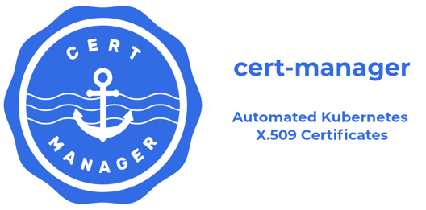

# Cert-Manager Supervisor Service

Utilizing the open source [cert-manager](https://cert-manager.io/docs/) project, you can manage your certificates in Supervisors. 
Simplifying the process of obtaining, renewing and using certificates, the `cert-manager` integration in Supervisor is fully supported by VMware when using the following issuers: 

* External CA Issuer supported by cert-manager
* Self-signed CA Issuer

## API reference
[Supervisor Cert-Manager API Reference](http://developers.eng.vmware.com/apis/iaas/cert-manager.io/)

## Tutorials
* [Deploy a CA Issuer and request a Certificate](#deploy-a-ca-issuer-and-request-a-certificate)
* [Deploy a Self-Signed Issuer and request a Certificate](#deploy-a-self-signed-issuer-and-request-a-certificate)
* [How-To Deploy a Cluster CA Issuer and Request a Certificate](#how-to-deploy-a-self-signed-ca-issuer-and-request-a-certificate)

## How-To Deploy a self-signed CA Issuer and Request a Certificate

The CA issuer represents a self-signed Certificate Authority (CA) whose signing certificate and private key are stored inside the Supervisor as a Kubernetes secret. 
The issuer is scoped to a namespace and will issue certificates within the same namespace. In this workflow, you will create a self-signed signing certificate and private key and store it as a secret. 
Then you will use this secret to configure a CA Issuer. Once the Issuer is deployed, you will then create a Certificate request and have a Certificate issued that is signed by the Certificate Authority you just created. 

⚠️ CA issuers are generally either for trying `cert-manager` out, or else for advanced users with a good idea of how to run a PKI. 
To be used safely in production, self-signed CA issuers introduce complex planning requirements around rotation, trust store distribution and disaster recovery.

1. Create a self-signed certificate authority and private key *⚠️Warning You should use enterprise provided certs when possible*
```bash
# Copy the default openssl configuration file locally and add the v3 extension (this is required to create a certificate authority)
$ cp /etc/ssl/openssl.cnf openssl.cnf 
$ echo "[ v3_ca ]
basicConstraints = critical,CA:TRUE
subjectKeyIdentifier = hash
authorityKeyIdentifier = keyid:always,issuer:always
" >> openssl.cnf 

# Create a private key (CA_private_key.pem) and a self-signed CA Certificate (CA_certificate.crt), valid for 1 year
# You'll have to follow the prompts to fill out certificate request fields
$ openssl req -new -x509 -newkey rsa:2048 -nodes -keyout CA_private_key.pem -out CA_certificate.pem -sha256 -days 365 -extensions v3_ca -config openssl.cnf 

```
2. Login to your namespace `my-namespace` and create a Kubernetes secret that contains the encoded certificate and private key generated above
```bash
$ kubectl config use-context my-namespace
Switched to context "my-namespace".

$ kubectl create secret tls my-ca-pair --key CA_private_key.pem --cert CA_certificate.pem -n my-namespace
secret/my-ca-pair created

# Verify the secret
$ kubectl get secret/my-ca-pair -n my-namespace -o yaml
apiVersion: v1
data:
  tls.crt: LS0tLS1CRUdJTiBDRVJUSUZJQ0FURS0tLS0tCk1JSUVvVENDQTRtZ0F3SUJBZ0lKQUlQTThMZEdQTVdDTUEwR0NTcUdTSWIzRFFFQkN3VUFNSUdRTVFzd0NRWUQKVlFRR0V3SlZVekVMTUFrR0ExVUVDQXdDUTBFeEVqQVFCZ05WQkFjTUNWQmhiRzhnUVd4MGJ6RVZNQk1HQTFVRQpDZ3dNVmsxM1lYSmxMQ0JKYm1NdU1RNHdEQVlEVlFRTERBVlVZVzU2ZFRFVk1CTUdBMVVFQXd3TVkyVnlkQzFsCmVHRnRjR3hsTVNJd0lBWUpLb1pJaHZjTkFRa0JGaE51YnkxeVpYQnNlVUIyYlhkaGNtVXVZMjl0TUI0WERUSXkKTVRBd05URTJNREEwTkZvWERUSXpNVEF3TlRFMk1EQTBORm93Z1pBeEN6QUpCZ05WQkFZVEFsVlRNUXN3Q1FZRApWUVFJREFKRFFURVNNQkFHQTFVRUJ3d0pVR0ZzYnlCQmJIUnZNUlV3RXdZRFZRUUtEQXhXVFhkaGNtVXNJRWx1Cll5NHhEakFNQmdOVkJBc01CVlJoYm5wMU1SVXdFd1lEVlFRRERBeGpaWEowTFdWNFlXMXdiR1V4SWpBZ0Jna3EKaGtpRzl3MEJDUUVXRTI1dkxYSmxjR3g1UUhadGQyRnlaUzVqYjIwd2dnRWlNQTBHQ1NxR1NJYjNEUUVCQVFVQQpBNElCRHdBd2dnRUtBb0lCQVFDc1FleWtjVHlycUhjQlFwY2hMVmlVNmJrZHlVdVpqa2FvVW1CRmZDYXl5b0pxCmI3eWRLdmptb2hkTlVrbnllZjFZVEVDUFh2dEc4T25XNjhkMkU2ZldmTEh1c2hCRmNodWswSjREcFIwSXNFaHkKejh4Sys0cm10K01WK3RVR0l1cmVQbEVrZlVnSTg1amxnRTg2dk9KM0hrWG1jQnpVN3dVeWRneUZ2SjVlQTJUbgpoR0owc3RlaGt1dHBwbFZqbFQ3Vko2aWY1Mlk0N3k2NVFKTlMvMjVoSFAxWGIyTVNLdWtVQ1hqcVoxQkJiVFlSClVwSWNXUG40ejNnbWswV29mdXVzN2Y4ZyswRUdBa1VyelFmdlEycDJjeE9QaXVieWFsMVo0a0dKTXdraWZtUGoKUzh6UG5LWStzZGVoeXAyUFJIaTZZS2ZpMXNiM0VyeEVLbFA3MEdIUkFnTUJBQUdqZ2Zzd2dmZ3dEd1lEVlIwVApBUUgvQkFVd0F3RUIvekFkQmdOVkhRNEVGZ1FVQis1TlExV2ROZk9rcVZDaUR0dEpSUUxDMGtRd2djVUdBMVVkCkl3U0J2VENCdW9BVUIrNU5RMVdkTmZPa3FWQ2lEdHRKUlFMQzBrU2hnWmFrZ1pNd2daQXhDekFKQmdOVkJBWVQKQWxWVE1Rc3dDUVlEVlFRSURBSkRRVEVTTUJBR0ExVUVCd3dKVUdGc2J5QkJiSFJ2TVJVd0V3WURWUVFLREF4VwpUWGRoY21Vc0lFbHVZeTR4RGpBTUJnTlZCQXNNQlZSaGJucDFNUlV3RXdZRFZRUUREQXhqWlhKMExXVjRZVzF3CmJHVXhJakFnQmdrcWhraUc5dzBCQ1FFV0UyNXZMWEpsY0d4NVFIWnRkMkZ5WlM1amIyMkNDUUNEelBDM1JqekYKZ2pBTkJna3Foa2lHOXcwQkFRc0ZBQU9DQVFFQVM4M3QvU0QrUDkrVjVXV1A0VEVwczZvRVdQT2tQUE8yQTVCUApkSUtGRUFEUTEyM25OeW9aT0V1RTE3U0ozZ0F3ckszUldudDlReTQwb2QxTnpMdG5HYTBSK1NWZVJ1S0dVZVdTCkFTVkJpRGVuRDU5U3U2TWJBb2gwdCtyVlZpNE54Q2VqMFJmTFllY09Kcm5DZG5xSkhhNzZ1UmsxQXhXOHByYksKTFprbm81V250L3Fma3BEcHdXQVlVdDlFWGptWDhWeEduTVljSFNJMVRHOXlqZDVoaU5WekJUOVQ0TGJEa0pqcwp3YU1USXV4cllLOG5lYklmTTV1aWdtdmtCOGJCandBL1pSRGVkOWR3L2wxd002a0dFU2VTbU9BVUtzLytLWCtBCnZmcHVLTGF6djJrdndQb0NncmlldEs3MFc3bUJMODdTUUYxME1iOUw5dWpoUExxQnJnPT0KLS0tLS1FTkQgQ0VSVElGSUNBVEUtLS0tLQo=
  tls.key: LS0tLS1CRUdJTiBQUklWQVRFIEtFWS0tLS0tCk1JSUV2UUlCQURBTkJna3Foa2lHOXcwQkFRRUZBQVNDQktjd2dnU2pBZ0VBQW9JQkFRQ3NRZXlrY1R5cnFIY0IKUXBjaExWaVU2YmtkeVV1WmprYW9VbUJGZkNheXlvSnFiN3lkS3ZqbW9oZE5Va255ZWYxWVRFQ1BYdnRHOE9uVwo2OGQyRTZmV2ZMSHVzaEJGY2h1azBKNERwUjBJc0VoeXo4eEsrNHJtdCtNVit0VUdJdXJlUGxFa2ZVZ0k4NWpsCmdFODZ2T0ozSGtYbWNCelU3d1V5ZGd5RnZKNWVBMlRuaEdKMHN0ZWhrdXRwcGxWamxUN1ZKNmlmNTJZNDd5NjUKUUpOUy8yNWhIUDFYYjJNU0t1a1VDWGpxWjFCQmJUWVJVcEljV1BuNHozZ21rMFdvZnV1czdmOGcrMEVHQWtVcgp6UWZ2UTJwMmN4T1BpdWJ5YWwxWjRrR0pNd2tpZm1QalM4elBuS1krc2RlaHlwMlBSSGk2WUtmaTFzYjNFcnhFCktsUDcwR0hSQWdNQkFBRUNnZ0VBVzBRV2dFM3F5anhZeVJjaUFaY0gvdVlTaVlDVWlJaEVVWHhMdTZUNnovSFIKeFZqc1F3MTRrS0hDM05uRGlqQXVGYkZZNTExNG51Nlh4cUpuck56ZktSb3FJQURCOURsd0FoUHlGSlpQMnNHagpzUWorQWFCaXlMa1hIUmNuOUxkZFgyRC9GdWsxMkdCUVd4QnZhZnlYdEdzYXQrd2dxb1QxYVBYNHpvYlFGWml4CmI3UEU0V3M0eEV5YlM3eXA3WllnMkpnWjBYTGROa3d2SXYzTWRab3hLaklJMTN1ZUhsNmJrM1k0bWd3Wm8wUUsKaU9jQVhpR2l0VkJ0WGZ3bC9IbytrTm9oYmFxQ0NOR2NaTWlqa3JKdTIvUVMyc3MxNEVkdGErZTZnZWhiaXQwLwpadmp0U1hRbFBvbzEvWngwN2xyOEdOQ3BqQ3VqN29oeVBMSXp3WHR1QVFLQmdRRGt3NEd4d0dvYnFETi9IbGJZCk9ab1hnSnpFYXIxTVVBU3VEU0MvckQ5QnQrU0MwMXZ3bEtwT0lENWNwQTJhbXdHdDFKcS9KV0QzcmQ0MmFnSDMKclhQeVI5WW5KYkw4L2x5a2hjd3hiZHAyMkFyM2FGRDk1Tllrd3psK1NjanR6dG9xTDZUWUNOeEp6K2N1UTFPNApJWEJZelMySHdmMlIxMkJQQkFhY0l1Z0ljUUtCZ1FEQXhDb3NmVWlUL1F5SE1jTytPNmNoeEJWaUlyYU5hbXU2CkdwaXJGWXlZNDNEYldnYkU3SHdTVHJFdU1EWnRMS1FuemJSUURpUVZjSm5QODZGSUJOakdDelZOZXhLWVhPK3QKUE8yaEsxMG9vQXM5QWJUV05IbUtyRWcxSm5XSDhGR2tmaVdEVFNUY0U5aktnTUJTMnVTQ3dEYXkxSXBSenpqTgpWa2lmU3BlZllRS0JnQU5HTVJNRU9BQ1JWYnRhQ2RBcWN1UW5PUmN1bCtzQnNpOXpqS1p4cHE0Z0hhc3ByMFV3Ck80Zkd1bDNGRTFURkp5Ny92ZjlDWDdMcjBDUmpQQWY1ZVpGY0tkcUJsYUE5VzhJWEVDY2M5V1dDRGhZZ2JoaFUKTUNSeWp0NFozRUJiRjVCSEFrcjlSWG5nK2VRVm5wc2lEMk9WL0RMWE9mUGVhMGgyUEVuN3plcGhBb0dBRkR5RApzT2YyRnBNYUhaYzcxVnl0enYybXdRYWo0M1NvbW9Ed1JnV2RITy9EaVVPS01tSWhKRXJlanRyQTIvVXp4bm54CjAvV29GQmdlRFphbDk4bUtlRC8wK0kxVEJtdTdQWlNIM2NPUHBCUXBHZDV6L1lqRXVhb2NhbmYvSHFZNzYralMKUjFaeDZDaXRPWlVLbTZnZkZScllveTFzMStuSkxNVkNHbmJhTkFFQ2dZRUF5OFc4VFJIUDBPNExzVFE0ZTNTMQpKVUR6WHlMbjNZRHVGS0lQakdheEEyMDR0SzR4UldmM2JJcjFTQVhjYUlMTGo5cHhsdjBoSmgxaVlaQ25UL2tuClVjVFU3ZG9hbzRPeURoUnZnK3dKV01XbG84MEh3OFE4N2xBWk42eTFPUTRlUm5JRm9Rak1PWjU0bVFYK1prTlIKYzBPM0M4a2NRN0tEZTdDWk81TUpzV1U9Ci0tLS0tRU5EIFBSSVZBVEUgS0VZLS0tLS0K
kind: Secret
metadata:
  creationTimestamp: "2022-10-05T16:11:22Z"
  name: my-ca-pair
  namespace: my-namespace
  resourceVersion: "29761166"
  selfLink: /api/v1/namespaces/my-namespace/secrets/my-ca-pair
  uid: a744c02f-88c0-4e0a-a421-0f2792b6a652
type: kubernetes.io/tls
```

3. Create a CA Issuer referencing the previously created secret
```bash
$ cat <<EOF | kubectl apply -f -
  apiVersion: cert-manager.io/v1
  kind: Issuer
  metadata:
    name: my-ca
    namespace: my-namespace
  spec:
    ca:
      secretName: my-ca-pair
EOF
issuer.cert-manager.io/my-ca created

# Check the newly created issuer is "Ready"
$ kubectl get issuers my-ca -o wide
NAME    READY   STATUS                AGE
my-ca   True    Signing CA verified   4s
```

4. Now request a certificate signed by the CA created above
```bash
$ cat <<EOF| k apply -f -
apiVersion: cert-manager.io/v1
kind: Certificate
metadata:
  name: vsphere-with-tanzu-local
  namespace: my-namespace
spec:
  secretName: vsphere-with-tanzu-local-tls
  secretTemplate:
    annotations:
      my-secret-annotation-1: "tanzu"
      my-secret-annotation-2: "is"
    labels:
      my-secret-label: awesome
  issuerRef:
    name: my-ca
    kind: Issuer
    group: cert-manager.io
  commonName: vsphere-with-tanzu.local
  dnsNames:
    - www.vsphere-with-tanzu.local
EOF
certificate.cert-manager.io/vsphere-with-tanzu-local created

# Wait for certificate to be ready
$ kubectl get certificate -n my-namespace -w
NAME                       READY   SECRET                           AGE
vsphere-with-tanzu-local   True    vsphere-with-tanzu-local-tls     21s
```

The certificate is now available in the Kubernetes secret `vsphere-with-tanzu-local-tls` with the additional labels and annotations provided:
```bash
$ kubectl get secret vsphere-with-tanzu-local-tls -o yaml
apiVersion: v1
data:
  ca.crt: LS0tLS1CRUdJTiBDRVJUSUZJQ0FURS0tLS0tCk1JSUVvVENDQTRtZ0F3SUJBZ0lKQUlQTThMZEdQTVdDTUEwR0NTcUdTSWIzRFFFQkN3VUFNSUdRTVFzd0NRWUQKVlFRR0V3SlZVekVMTUFrR0ExVUVDQXdDUTBFeEVqQVFCZ05WQkFjTUNWQmhiRzhnUVd4MGJ6RVZNQk1HQTFVRQpDZ3dNVmsxM1lYSmxMQ0JKYm1NdU1RNHdEQVlEVlFRTERBVlVZVzU2ZFRFVk1CTUdBMVVFQXd3TVkyVnlkQzFsCmVHRnRjR3hsTVNJd0lBWUpLb1pJaHZjTkFRa0JGaE51YnkxeVpYQnNlVUIyYlhkaGNtVXVZMjl0TUI0WERUSXkKTVRBd05URTJNREEwTkZvWERUSXpNVEF3TlRFMk1EQTBORm93Z1pBeEN6QUpCZ05WQkFZVEFsVlRNUXN3Q1FZRApWUVFJREFKRFFURVNNQkFHQTFVRUJ3d0pVR0ZzYnlCQmJIUnZNUlV3RXdZRFZRUUtEQXhXVFhkaGNtVXNJRWx1Cll5NHhEakFNQmdOVkJBc01CVlJoYm5wMU1SVXdFd1lEVlFRRERBeGpaWEowTFdWNFlXMXdiR1V4SWpBZ0Jna3EKaGtpRzl3MEJDUUVXRTI1dkxYSmxjR3g1UUhadGQyRnlaUzVqYjIwd2dnRWlNQTBHQ1NxR1NJYjNEUUVCQVFVQQpBNElCRHdBd2dnRUtBb0lCQVFDc1FleWtjVHlycUhjQlFwY2hMVmlVNmJrZHlVdVpqa2FvVW1CRmZDYXl5b0pxCmI3eWRLdmptb2hkTlVrbnllZjFZVEVDUFh2dEc4T25XNjhkMkU2ZldmTEh1c2hCRmNodWswSjREcFIwSXNFaHkKejh4Sys0cm10K01WK3RVR0l1cmVQbEVrZlVnSTg1amxnRTg2dk9KM0hrWG1jQnpVN3dVeWRneUZ2SjVlQTJUbgpoR0owc3RlaGt1dHBwbFZqbFQ3Vko2aWY1Mlk0N3k2NVFKTlMvMjVoSFAxWGIyTVNLdWtVQ1hqcVoxQkJiVFlSClVwSWNXUG40ejNnbWswV29mdXVzN2Y4ZyswRUdBa1VyelFmdlEycDJjeE9QaXVieWFsMVo0a0dKTXdraWZtUGoKUzh6UG5LWStzZGVoeXAyUFJIaTZZS2ZpMXNiM0VyeEVLbFA3MEdIUkFnTUJBQUdqZ2Zzd2dmZ3dEd1lEVlIwVApBUUgvQkFVd0F3RUIvekFkQmdOVkhRNEVGZ1FVQis1TlExV2ROZk9rcVZDaUR0dEpSUUxDMGtRd2djVUdBMVVkCkl3U0J2VENCdW9BVUIrNU5RMVdkTmZPa3FWQ2lEdHRKUlFMQzBrU2hnWmFrZ1pNd2daQXhDekFKQmdOVkJBWVQKQWxWVE1Rc3dDUVlEVlFRSURBSkRRVEVTTUJBR0ExVUVCd3dKVUdGc2J5QkJiSFJ2TVJVd0V3WURWUVFLREF4VwpUWGRoY21Vc0lFbHVZeTR4RGpBTUJnTlZCQXNNQlZSaGJucDFNUlV3RXdZRFZRUUREQXhqWlhKMExXVjRZVzF3CmJHVXhJakFnQmdrcWhraUc5dzBCQ1FFV0UyNXZMWEpsY0d4NVFIWnRkMkZ5WlM1amIyMkNDUUNEelBDM1JqekYKZ2pBTkJna3Foa2lHOXcwQkFRc0ZBQU9DQVFFQVM4M3QvU0QrUDkrVjVXV1A0VEVwczZvRVdQT2tQUE8yQTVCUApkSUtGRUFEUTEyM25OeW9aT0V1RTE3U0ozZ0F3ckszUldudDlReTQwb2QxTnpMdG5HYTBSK1NWZVJ1S0dVZVdTCkFTVkJpRGVuRDU5U3U2TWJBb2gwdCtyVlZpNE54Q2VqMFJmTFllY09Kcm5DZG5xSkhhNzZ1UmsxQXhXOHByYksKTFprbm81V250L3Fma3BEcHdXQVlVdDlFWGptWDhWeEduTVljSFNJMVRHOXlqZDVoaU5WekJUOVQ0TGJEa0pqcwp3YU1USXV4cllLOG5lYklmTTV1aWdtdmtCOGJCandBL1pSRGVkOWR3L2wxd002a0dFU2VTbU9BVUtzLytLWCtBCnZmcHVLTGF6djJrdndQb0NncmlldEs3MFc3bUJMODdTUUYxME1iOUw5dWpoUExxQnJnPT0KLS0tLS1FTkQgQ0VSVElGSUNBVEUtLS0tLQo=
  tls.crt: LS0tLS1CRUdJTiBDRVJUSUZJQ0FURS0tLS0tCk1JSURxVENDQXBHZ0F3SUJBZ0lSQU5yNTZIcGN1aVdWUGNreWlBNTN5T0F3RFFZSktvWklodmNOQVFFTEJRQXcKZ1pBeEN6QUpCZ05WQkFZVEFsVlRNUXN3Q1FZRFZRUUlEQUpEUVRFU01CQUdBMVVFQnd3SlVHRnNieUJCYkhSdgpNUlV3RXdZRFZRUUtEQXhXVFhkaGNtVXNJRWx1WXk0eERqQU1CZ05WQkFzTUJWUmhibnAxTVJVd0V3WURWUVFECkRBeGpaWEowTFdWNFlXMXdiR1V4SWpBZ0Jna3Foa2lHOXcwQkNRRVdFMjV2TFhKbGNHeDVRSFp0ZDJGeVpTNWoKYjIwd0hoY05Nakl4TURBMU1UWXhOekkzV2hjTk1qTXdNVEF6TVRZeE56STNXakFqTVNFd0h3WURWUVFERXhoMgpjM0JvWlhKbExYZHBkR2d0ZEdGdWVuVXViRzlqWVd3d2dnRWlNQTBHQ1NxR1NJYjNEUUVCQVFVQUE0SUJEd0F3CmdnRUtBb0lCQVFDaGo2WFd5c2FKNEEzeG1MZWI3eU9qSERxUXY1WWJTRnNVMW5ndDNDUGJWKzhERXk3MjZYQjMKS3l3QnQyZ3JSQjlybFErejg4V1p5OXlPeGJNRXhDTjJDTm1NYnV0ZWg1cnFWU1RvbjJPeCtHVGU5T1RTUDNQSgpYSkhiQnFSb1k4RkYzNHY0MXRoSm82REtyVElLY1VhYVJXV2hRVnRsVEhuYUhBWUw0akt4OURXcEROOEpsOVY0CmJhV0RBeHFVYk5hNWpDckZlZjlLZHA5aVJRSmFrbTZpREZWWTRYSVozY1dCSDZTN2lTYUErWlNJVis2OUh4cVoKVE9tMVg1TmpqbW54T2RkMlRnRUtVZzh3SmY5dFZ3OGs1UkRYNDBpMEZsaHRaYjFtK2cxdGpGcHd6bE5FT0dsZQpwUTZMTTlEdktaM2pPZWd3L29yT1RVY3UwRExBS0NMaEFnTUJBQUdqYWpCb01BNEdBMVVkRHdFQi93UUVBd0lGCm9EQU1CZ05WSFJNQkFmOEVBakFBTUI4R0ExVWRJd1FZTUJhQUZBZnVUVU5WblRYenBLbFFvZzdiU1VVQ3d0SkUKTUNjR0ExVWRFUVFnTUI2Q0hIZDNkeTUyYzNCb1pYSmxMWGRwZEdndGRHRnVlblV1Ykc5allXd3dEUVlKS29aSQpodmNOQVFFTEJRQURnZ0VCQUtPWXNFbE5hSkcwM0tFUWZ3clZOczQ5ajBEeDhoTlBFZXQwY3VFM0YzVkRmQVRnCi9PaHNZdkIrMzlRTTRsL1NHcTNFNnRHbHR5YWNCcW84WWh1cHFJT09PcnRjaG1iOUY3NzJFSGg0eFpUQkNhR0cKZVpDVkNQdzh2dGZrL0pwUW5GWTRrTHZaWExEVzd2dnNlN3VZaG10MGRKL0t2RWNPOHl1K1JqSlZxcDhnTW9BMwpabnZOTHE4V0FzeUpmemtwaXdON0VRUzg3ZUNJVDVVWVk0bjBLRWtEZ1dhYi9PUTVZSm00Q08vUkZlYnVPTEhrCnc4UDladGxJajl5bUE2ekpaaVBtK2xNVVpDRXEwTVNoZjZZNTB0Nk0zNWFaZ2xmTU5BNEdkMmNZdmxXZmRiYUEKcjdoTzAvZlUzMG1HQTNUdWR2Zk8zUTJWZENhZndUaUQ4bjRUYTh3PQotLS0tLUVORCBDRVJUSUZJQ0FURS0tLS0tCg==
  tls.key: LS0tLS1CRUdJTiBSU0EgUFJJVkFURSBLRVktLS0tLQpNSUlFcFFJQkFBS0NBUUVBb1krbDFzckdpZUFOOFppM20rOGpveHc2a0wrV0cwaGJGTlo0TGR3ajIxZnZBeE11Cjl1bHdkeXNzQWJkb0swUWZhNVVQcy9QRm1jdmNqc1d6Qk1RamRnalpqRzdyWG9lYTZsVWs2Sjlqc2ZoazN2VGsKMGo5enlWeVIyd2FrYUdQQlJkK0wrTmJZU2FPZ3lxMHlDbkZHbWtWbG9VRmJaVXg1Mmh3R0MrSXlzZlExcVF6ZgpDWmZWZUcybGd3TWFsR3pXdVl3cXhYbi9TbmFmWWtVQ1dwSnVvZ3hWV09GeUdkM0ZnUitrdTRrbWdQbVVpRmZ1CnZSOGFtVXpwdFYrVFk0NXA4VG5YZGs0QkNsSVBNQ1gvYlZjUEpPVVExK05JdEJaWWJXVzladm9OYll4YWNNNVQKUkRocFhxVU9pelBRN3ltZDR6bm9NUDZLemsxSEx0QXl3Q2dpNFFJREFRQUJBb0lCQUJLMzJ1WDAzbVhSQUt5UwpIZ3ZCL0NZRXVrQlZBaVl0RHVodUpNUmpjZ0FTd3cxZkpwelMxUVhwaVpLMVZpdFZIRExSdFYwTERFVFNXcjVyCjUxN1EvcTdKUGJOSWtwcUVLWTJteWJ6dDRwWVhDbERPbk1oRE03NExySlpzd1pXYW9TVGdUbzVKRGd3U0dpb0IKUVAvMnVkQmI0L2QzNUFmcmdWNmt5b3FMN1lXeWIzWVBNWUJzZDhkSjVRa252dzhkMFcyb1NWRG1VZXVwNGFhRgoxcTZWN0JDZWErMVIrT2h4UEMxaFgvV2RxSU1YcDAyM0Y3K0pVeng1dU93czFWbW5aZ2t0SG1EZi9kQmxSWmVLCmxZRFhITFlYMEp6enZZNTBrOXdscDZwQ3B5MXN5QjI4Yld4ZkJ0b3I4eTd4ZjluWnBQbXpxTC9iUXpRZzh1S0IKZkRkMEZEVUNnWUVBMEFIWTdUeFd3cm1QZkRjM0dPbDRlYStmdDRqcDM2TTVVQ0locXFBVWJ1VGtXVW5KTnRTQQorN0p6N3picmhPWmVabFl4cVNFSXZmOXVoc21OQVA3OXIxZDhGaTAxbmVIbjJEblFIRkM2MXAxMGE1TW9SL3RGCmx1c2R3RDNtVzM3K3N0SkVBZ24wMWpYQW5BNEhzTUQ3SklFSW5EU2JJYU1Ib1JvQk12dTJEQk1DZ1lFQXh0WnEKZWhkL0NQbnlydGN1NHR0T2JxZmpwcjlLRWNOZFhMa1hpUkxGcDl2U0YrcWVQZlJGdldtK0NlaGJ2MUREb0J0Ngp2eXB1UTl4YlNiMUZIbHkzMlZ6N0ttQlFCeXRwcEZkQ3pZVUtGSXhHKzhHSVQ4Y1NqcldVRnpFRjVBZTAwRXZSCmhNQlZtdCswQlNkcFUycHlubHVIZmRWWWZDdlhEKzZRSVNYRmk3c0NnWUVBdjBwVG9xaXc2VmNaRzVUenVKZE4KVWlzdTZPeWltQ1pWbU5vcXQrMkxuUWdtNys0cGU2RW1GVkxoeDRac1JjWk4zak02YkYyUzJwaERudlZRRlRCcgpRSXRsOUVjVFhlVFpBRUw2bm0rbnc2TDk0OGhyYlBjcDRrYkxEM1pkbUp0THhFd1dld0dKQms1Y21hZFZiem1xClBNSGxsekhSMExkTFZ0N0JaNCtRdGIwQ2dZRUFseWxrczBMdm1jUmpZZFpIVjhHLzQ5SVErTENPUCtqVkxtdXMKWDlIOG4vczJ3bVhrUFZkYU9ZQ05MLzBNMnVvc2ZxakZiVlYxbEhPT2x3V2o2VXcxbkxMYVkwSHJOVGdrelFKbAp6OWFuYmkyaXZUeEpROVVrMzRkZGVUQVV1V0crYldobWRWUysvOG0za3Y5K1RDTXQxZ1BoZ3FGUjdyeHBlRHcyCktHME52SWNDZ1lFQXhxYWFFMmpXSVpIOU9wdloyRW1nSTNNQXBmeEMwUDh6RnNqenVsWkk0VGNzWEtqL2owcFkKb0JSalNDUzNnYlp3MTBJY212amZsRENYWVU2UDFhakxJSEhZd1llL1kyTG9IZGF6VnBJMHJpNjV3QnkxTWVkTgpiNnU3N095UkVTR25rcjNuRmRKQWsxYVNsYU10UGN5SnBpaE10ckQ5RUVaTFFQcWh3bnFjaENBPQotLS0tLUVORCBSU0EgUFJJVkFURSBLRVktLS0tLQo=
kind: Secret
metadata:
  annotations:
    cert-manager.io/alt-names: www.vsphere-with-tanzu.local
    cert-manager.io/certificate-name: vsphere-with-tanzu-local
    cert-manager.io/common-name: vsphere-with-tanzu.local
    cert-manager.io/ip-sans: ""
    cert-manager.io/issuer-group: cert-manager.io
    cert-manager.io/issuer-kind: Issuer
    cert-manager.io/issuer-name: my-ca
    cert-manager.io/uri-sans: ""
    my-secret-annotation-1: tanzu
    my-secret-annotation-2: is
  creationTimestamp: "2022-10-05T16:17:27Z"
  labels:
    my-secret-label: awesome
  name: vsphere-with-tanzu-local-tls
  namespace: my-namespace
  resourceVersion: "29764773"
  selfLink: /api/v1/namespaces/my-namespace/secrets/vsphere-with-tanzu-local-tls
  uid: 840f5cc8-9a62-4341-b9bf-de3044da7f38
type: kubernetes.io/tls
```
When the certificate expires, it will now be automatically renewed by cert-manager.

#### CA Issuer Demo Video

⚠️ Coming soon ⚠️

## Deploy a Self-Signed Issuer and request a Certificate
1. Create Self-Signed Issuer
2. Request Certificate
3. Check on status of Certificate

#### Self-Signed Issuer Demo Video

⚠️ Coming soon ⚠️

## How-To Deploy a Cluster CA Issuer and Request a Certificate

In Tanzu on vSphere, only admins can create `ClusterIssuer`. If you're a vSphere administrator, install the ClusterIssuer Supervisor Service and 
provide the private key and signing certificate, or the external CA's server as the service configuration.
The secret holding the CA private key and signing certificate, or the issuer key for external CA, will be in the cert-manager namespace `vmware-system-cert-manager`.

Once the cluster issuer has been deployed, you can request a Certificate the same way you request a certificate from a namespace-scoped issuer.
Your administrator must communicate the issuer name to use, `my-cluster-issuer` in that example.

```bash
$ cat <<EOF| k apply -f -
apiVersion: cert-manager.io/v1
kind: Certificate
metadata:
  name: my-tanzu-cert
  namespace: my-namespace
spec:
  dnsNames:
    - vsphere-with-tanzu.com
  secretName: example-tls-cert
  issuerRef:
    name: my-cluster-issuer
    kind: ClusterIssuer
EOF
```